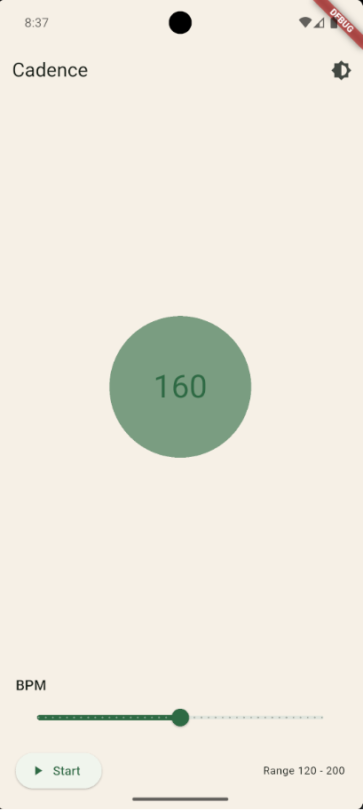
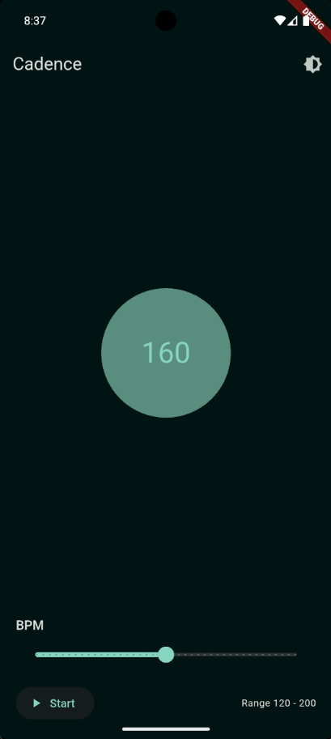

# Cadence

A simple metronome app for runners built with Flutter.

## About

Cadence helps you maintain a consistent step rate by providing an audible beat to match your stride rhythm. This can improve efficiency, reduce injury risk, and enhance endurance.

## Features

- Adjustable BPM (beats per minute)
- Simple, clean interface
- Audio metronome

## Screenshots

<p float="left">
  
  
</p>

<!-- Fallback for clients that don't honor float:left -->
<div style="clear:both"></div>

## Getting Started

### Prerequisites

- Flutter SDK
- Dart

### Installation

```bash
git clone https://github.com/shiqan/cadence.git
cd cadence
fvm flutter pub get
```

## License

Licensed under the [MIT License](LICENSE).